---
## Front matter
title: "Очёта по лабораторной работе №1"
subtitle: "НКНбд-02-21"
author: "Акондзо Жордани Лади Гаэл"

## Generic otions
lang: ru-RU
toc-title: "Содержание"

## Bibliography
bibliography: bib/cite.bib
csl: pandoc/csl/gost-r-7-0-5-2008-numeric.csl

## Pdf output format
toc: true # Table of contents
toc-depth: 2
lof: true # List of figures
fontsize: 12pt
linestretch: 1.5
papersize: a4
documentclass: scrreprt
## I18n polyglossia
polyglossia-lang:
  name: russian
  options:
	- spelling=modern
	- babelshorthands=true
polyglossia-otherlangs:
  name: english
## I18n babel
babel-lang: russian
babel-otherlangs: english
## Fonts
mainfont: PT Serif
romanfont: PT Serif
sansfont: PT Sans
monofont: PT Mono
mainfontoptions: Ligatures=TeX
romanfontoptions: Ligatures=TeX
sansfontoptions: Ligatures=TeX,Scale=MatchLowercase
monofontoptions: Scale=MatchLowercase,Scale=0.9
## Biblatex
biblatex: true
biblio-style: "gost-numeric"
biblatexoptions:
  - parentracker=true
  - backend=biber
  - hyperref=auto
  - language=auto
  - autolang=other*
  - citestyle=gost-numeric
## Pandoc-crossref LaTeX customization
figureTitle: "Рис."
listingTitle: "Листинг"
lofTitle: "Список иллюстраций"
lolTitle: "Листинги"
## Misc options
indent: true
header-includes:
  - \usepackage{indentfirst}
  - \usepackage{float} # keep figures where there are in the text
  - \floatplacement{figure}{H} # keep figures where there are in the text
---

# Цель работы

Цель данного работы --- Целью данной работы является приобретение практических навыков установки операционной системы на виртуальную машину, настройки минимально необходимых для дальнейшей работы сервисов.

# Задание

1. Версия ядра Linux (Linux version).

2. Частота процессора (Detected Mhz processor).

3. Модель процессора (CPU0).

4. Объем доступной оперативной памяти (Memory available).

5. Тип обнаруженного гипервизора (Hypervisor detected).

6. Тип файловой системы корневого раздела.

7. Последовательность монтирования файловых систем.

# Ход работы

1. Окно «Свойства» VirtualBox.(рис. [-@fig:001])

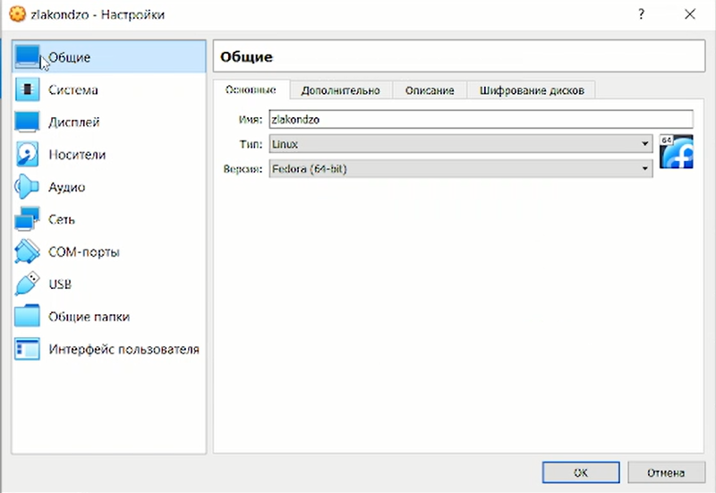{ #fig:001 width=70% }

2. Создайте новую виртуальную машину :

  - Для этого в VirtualBox выберите Машина Создать. Указал имя виртуальной машины (ваш логин в дисплейном классе), тип операционной системы — Linux, Fedora. (рис. [-@fig:002])
  
  - Указал размер основной памяти виртуальной машины — от 2048 МБ и задал конфигурацию жёсткого диска — загрузочный, VDI (BirtualBox Disk Image), динамический виртуальный диск.  (рис. [-@fig:003])
  
  - Задал размер диска — 80 ГБ (или больше), его расположение — в данном случае /var/tmp/имя_пользователя/fedora.vdi. (рис. [-@fig:004])

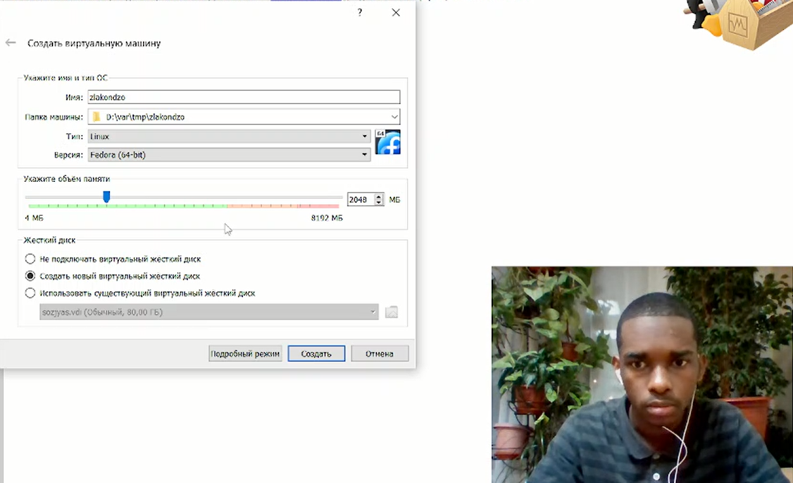{ #fig:002 width=70% }

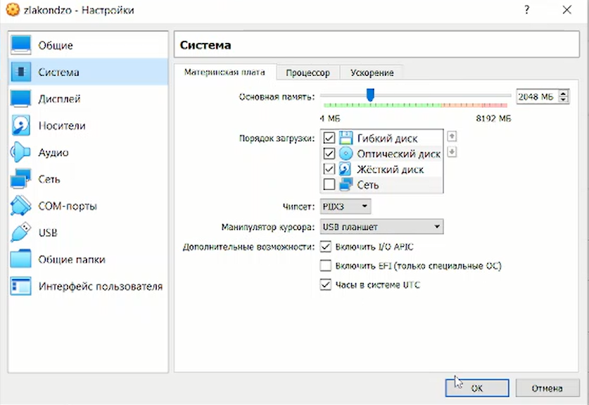{ #fig:003 width=70% }

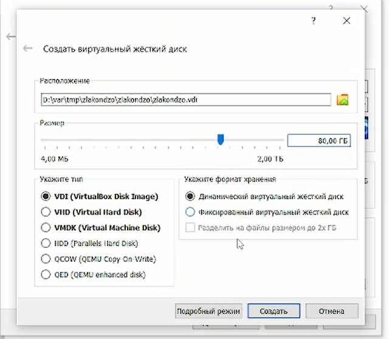{ #fig:004 width=70% }

  - Окно «Носители» виртуальной машины: выбор образа оптического диска. (рис. [-@fig:005])

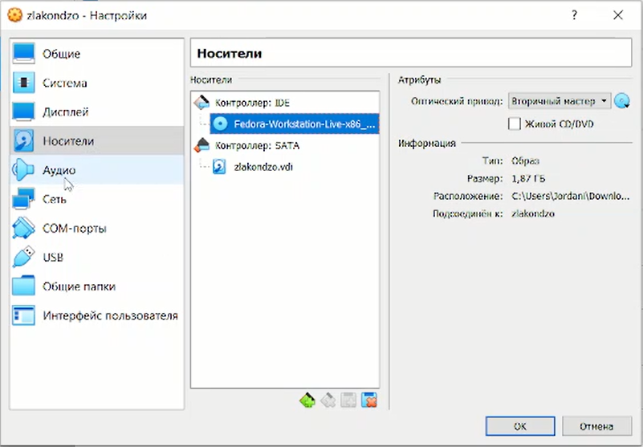{ #fig:005 width=70% }

  - Запустите виртуальную машину, выберите язык интерфейса и перейдите к настройкам установки операционной системы. (рис. [-@fig:006], [-@fig:007])
  
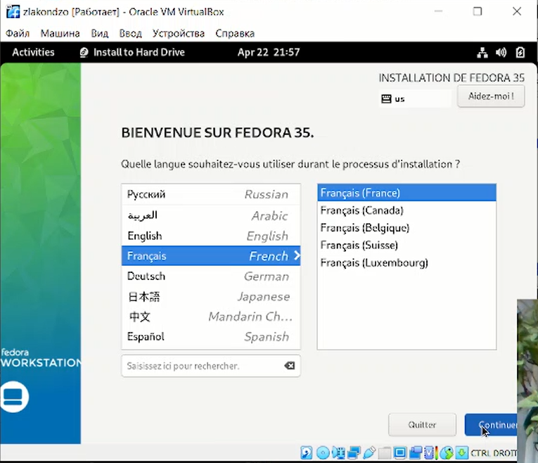{ #fig:006 width=70% }

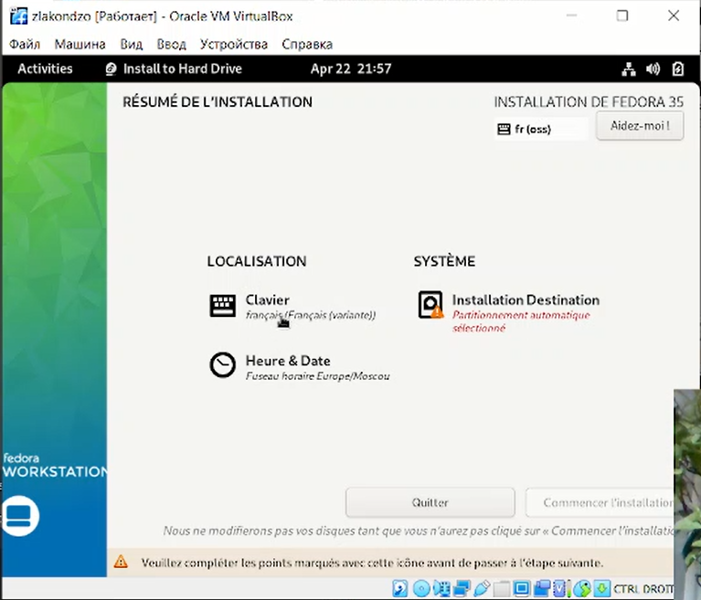{ #fig:007 width=70% }

  - Место установки ОС оставьте без изменения. (рис. [-@fig:008])
  
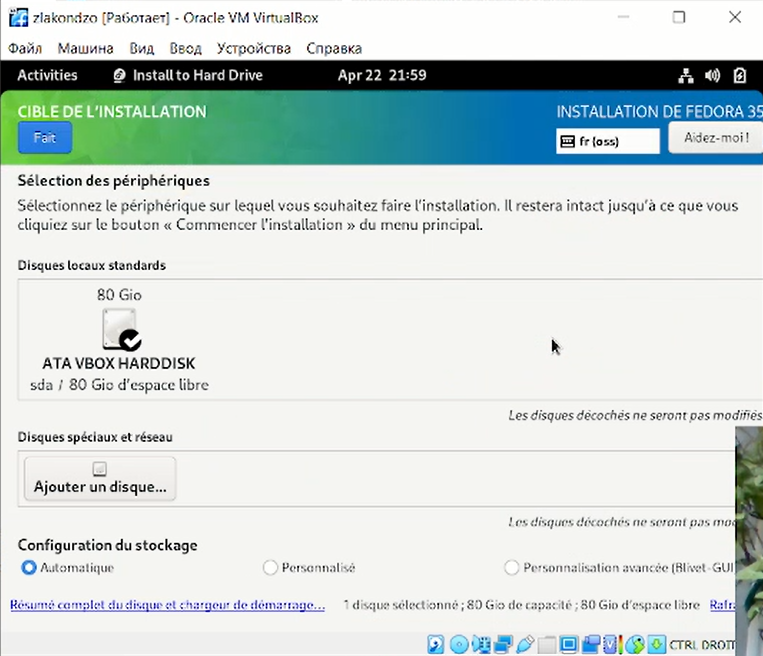{ #fig:008 width=70% }

  - После завершения установки операционной системы корректно перезапустите виртуальную машину. Установите имя и пароль для пользователя. (рис. [-@fig:009], [-@fig:010], [-@fig:011])
  
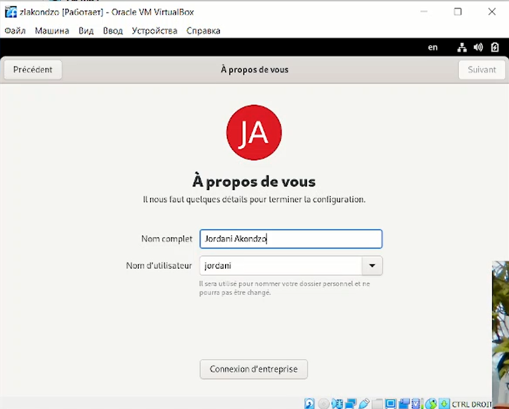{ #fig:009 width=70% }

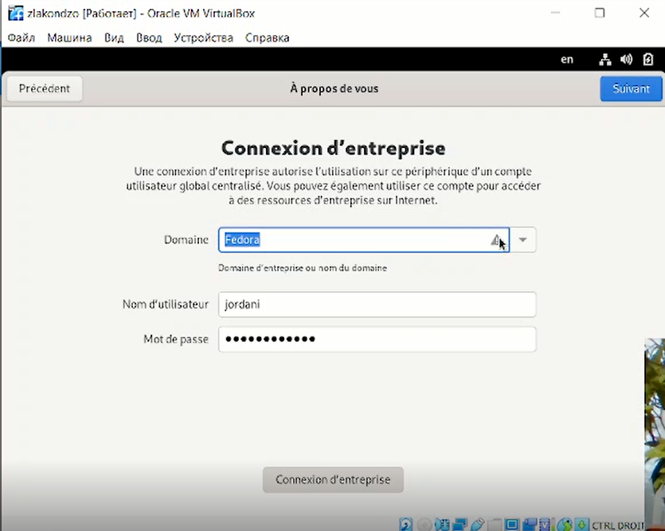{ #fig:010 width=70% }

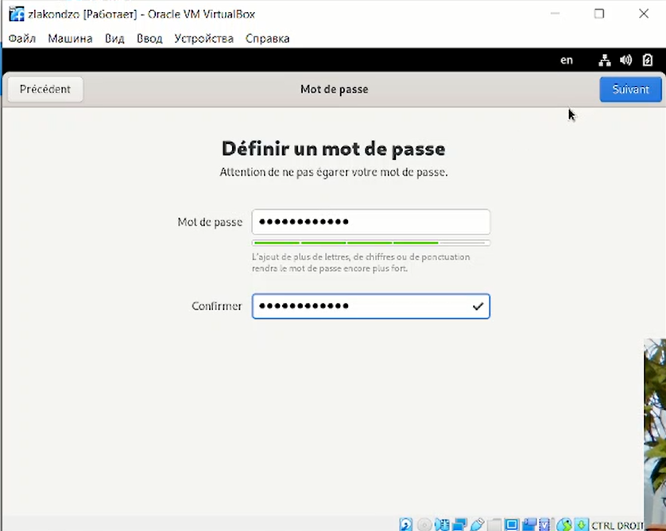{ #fig:011 width=70% }

  - Войдите в ОС под заданной вами при установке учётной записью. В меню Устройства виртуальной машины подключите образ диска дополнений гостевой ОС, при необходимости введите пароль пользователя root вашей виртуальной ОС. (рис. [-@fig:012])

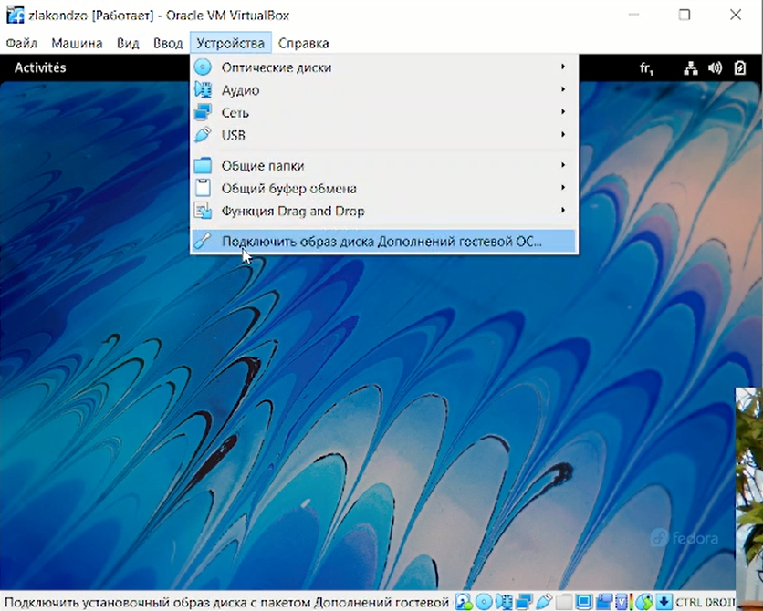{ #fig:012 width=70% }

3. Получите следующую информацию: 

  - Версия ядра Linux (Linux version). (рис. [-@fig:013])
  
  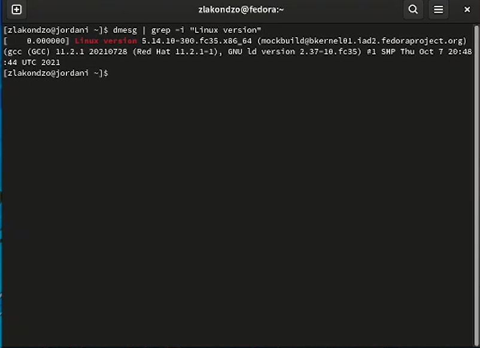{ #fig:013 width=70% }
  
  - Частота процессора (Detected Mhz processor). (рис. [-@fig:014])
  
  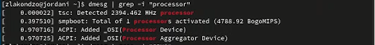{ #fig:014 width=70% }
  
  - Модель процессора (CPU0). (рис. [-@fig:015])
  
  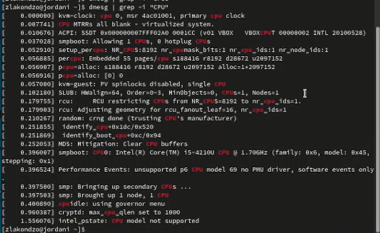{ #fig:015 width=70% }
  
  - Объем доступной оперативной памяти (Memory available). (рис. [-@fig:016])
  
  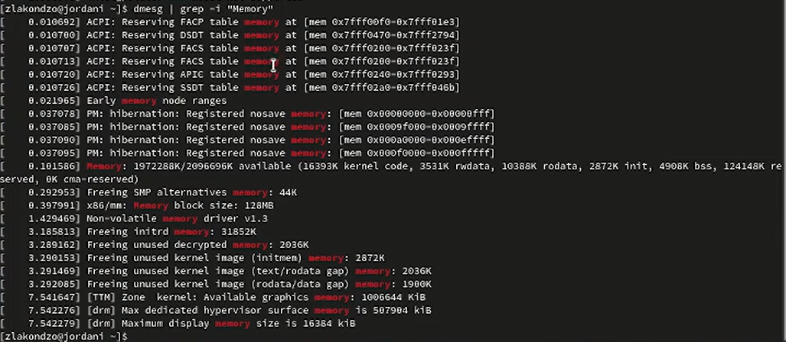{ #fig:016 width=70% }
  
  - Тип обнаруженного гипервизора (Hypervisor detected). (рис. [-@fig:017])
  
  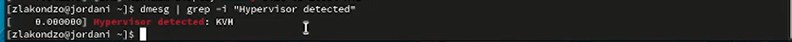{ #fig:017 width=70% }
  
  - Тип файловой системы корневого раздела. (рис. [-@fig:018])
  
  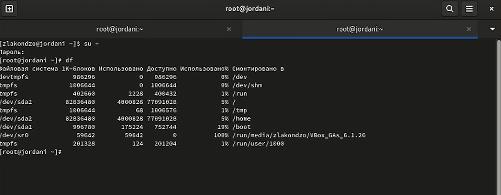{ #fig:018 width=70% }
  
  - Последовательность монтирования файловых систем. (рис. [-@fig:019])
  
  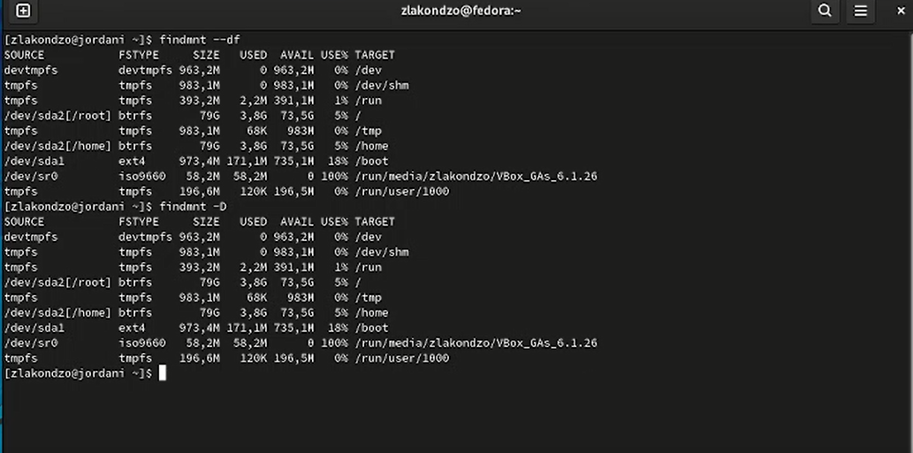{ #fig:019 width=70% }

# Выводы

Во время выполнения работы, мы приобрели практических навыков установки операционной системы на виртуальную машину, настройки минимально необходимых для дальнейшей работы сервисов.

::: {#refs}
:::
