---
## Front matter
title: "Отчёта по лабораторной работе №2"
subtitle: "НКНбд-02-21"
author: "Акондзо Жордани Лади Гаэл"

## Generic otions
lang: ru-RU
toc-title: "Содержание"

## Bibliography
bibliography: bib/cite.bib
csl: pandoc/csl/gost-r-7-0-5-2008-numeric.csl

## Pdf output format
toc: true # Table of contents
toc-depth: 2
lof: true # List of figures
lot: true # List of tables
fontsize: 12pt
linestretch: 1.5
papersize: a4
documentclass: scrreprt
## I18n polyglossia
polyglossia-lang:
  name: russian
  options:
	- spelling=modern
	- babelshorthands=true
polyglossia-otherlangs:
  name: english
## I18n babel
babel-lang: russian
babel-otherlangs: english
## Fonts
mainfont: PT Serif
romanfont: PT Serif
sansfont: PT Sans
monofont: PT Mono
mainfontoptions: Ligatures=TeX
romanfontoptions: Ligatures=TeX
sansfontoptions: Ligatures=TeX,Scale=MatchLowercase
monofontoptions: Scale=MatchLowercase,Scale=0.9
## Biblatex
biblatex: true
biblio-style: "gost-numeric"
biblatexoptions:
  - parentracker=true
  - backend=biber
  - hyperref=auto
  - language=auto
  - autolang=other*
  - citestyle=gost-numeric
## Pandoc-crossref LaTeX customization
figureTitle: "Рис."
tableTitle: "Таблица"
listingTitle: "Листинг"
lofTitle: "Список иллюстраций"
lotTitle: "Список таблиц"
lolTitle: "Листинги"
## Misc options
indent: true
header-includes:
  - \usepackage{indentfirst}
  - \usepackage{float} # keep figures where there are in the text
  - \floatplacement{figure}{H} # keep figures where there are in the text
---

# Цель работы

Цель данного работы --- Изучить идеологию и применение средств контроля версий. Освоить умения по работе с git.

# Задание

- Создать базовую конфигурацию для работы с git.

- Создать ключ SSH.

- Создать ключ PGP.

- Настроить подписи git.

- Зарегистрироваться на Github.

- Создать локальный каталог для выполнения заданий по предмету.

# Теоретическое введение

По определению система контроля версий (VCS) это программное обеспечение для облегчения работы с изменяющейся информацией. Системы контроля версий (Version Control System, VCS) применяются при работе нескольких человек над одним проектом. Git является распределённой системой контроля версий. Система контроля версий Git представляет собой набор программ командной строки. Доступ к ним можно получить из терминала посредством ввода команды git с различными опциями.
    В табл. [-@tbl:std-dir] приведено краткое описание наиболее часто используемых команд git.

: Описание основных команд git {#tbl:std-dir}

| **Команда**                  |**Описание действия**                                                                                                       |
|------------------------------|----------------------------------------------------------------------------------------------------------------------------|
| `git init`                   | создание основного дерева репозитория                                                                                      |
| `git pull `                  | получение обновлений (изменений) текущего дерева из центрального репозитория                                               |
| `git status`                 | просмотр списка изменённых файлов в текущей директории                                                                     |
| `git push`                   | отправка всех произведённых изменений локального дерева в центральный репозиторий                                          |
| `git diff`                   | просмотр текущих изменения                                                                                                 |
| `git add .`                  | добавить все изменённые и/или созданные файлы и/или каталоги                                                               |
| `git add имена_файлов`       | добавить конкретные изменённые и/или созданные файлы и/или каталоги                                                        |
| `git rm имена_файлов`        | удалить файл и/или каталог из индекса репозитория (при этом файл и/или каталог                                             |
|                              | остаётся в локальной директории)                                                                                           |
| `git commit -am 'Коммит'`    | сохранить все добавленные изменения и все изменённые файлы                                                                 |
| `git commit`                 | сохранить добавленные изменения с внесением комментария через встроенный                                                   |
|                              | редактор                                                                                                                   |
| `git checkout -b имя_ветки`  | создание новой ветки, базирующейся на текущей                                                                              |
| `git checkout имя_ветки`     | переключение на некоторую ветку                                                                                            |
| `git push origin имя_ветки`  | отправка изменений конкретной ветки в центральный репозиторий                                                              |
| `git branch -d имя_ветки`    | удаление локальной уже слитой с основным деревом ветки                                                                     |
| `git branch -D имя_ветки`    | принудительное удаление локальной ветки                                                                                    |
| `git push origin :имя_ветки` | удаление ветки с центрального репозитория                                                                                  |

# Ход работы

1. Настройка github

  Зарегистрировался на Github. (сайт https://github.com) (рис.[-@fig:001])

{ #fig:001 width=70% }

2. Установка git-flow в Fedora Linux

  Установил его вручную, введя следующие команды: (рис. [-@fig:002])
    
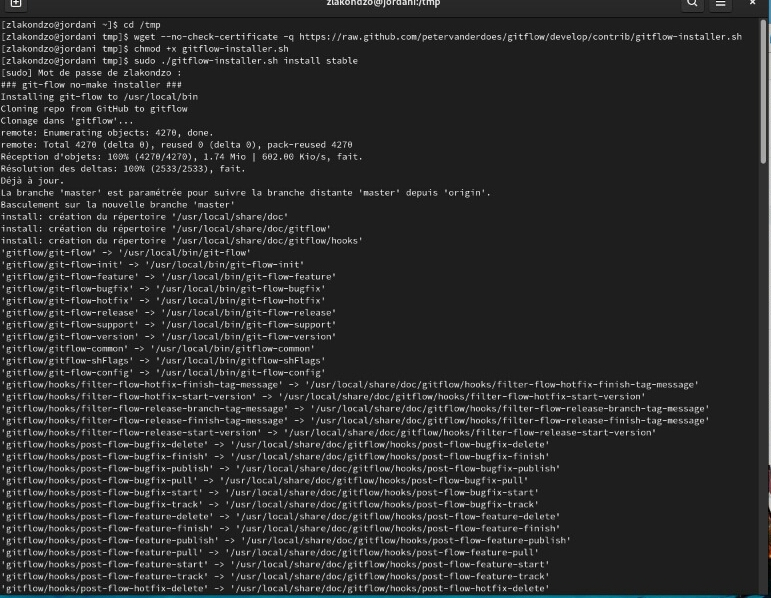{ #fig:002 width=70% }

3. Установка gh в Fedora Linux

  Использовал следующую команду: (рис. [-@fig:003])
    
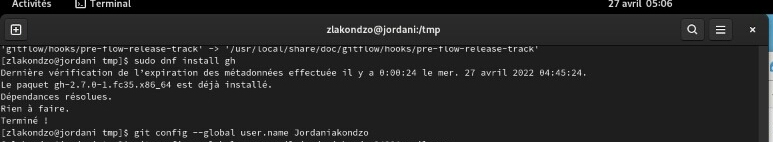{ #fig:003 width=70% }

4. Базовая настройка GIT

  - Задал имя и email владельца репозитория.
    
  - Настроил utf-8 в выводе сообщений git.
    
  - Задал имя начальной ветки, настроил параметры autocrlf и safecrlf.gpg (рис. [-@fig:004])
    
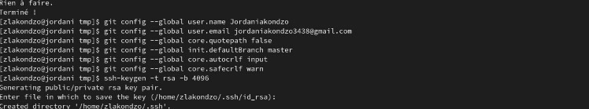{ #fig:004 width=70% }

5. Создание ключа gpg

   - Сгенерировал ключ ssh по алгоритму rsa и ed25519 (рис. [-@fig:005])
    
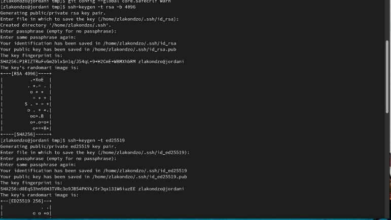{ #fig:005 width=70% }

   - Сгенерировал ключ pgp. (рис. [-@fig:006])
    
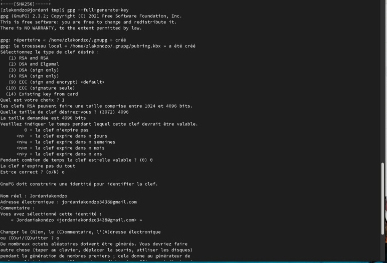{ #fig:006 width=70% }
     
6. Добавление pgp ключа в Github
    
  - Выводил список ключей и копировал отпечаток приватного ключаю.
    
  - Скопировал мой сгенерированный pgp ключ в буфер обмена.
    (рис. [-@fig:007])
    
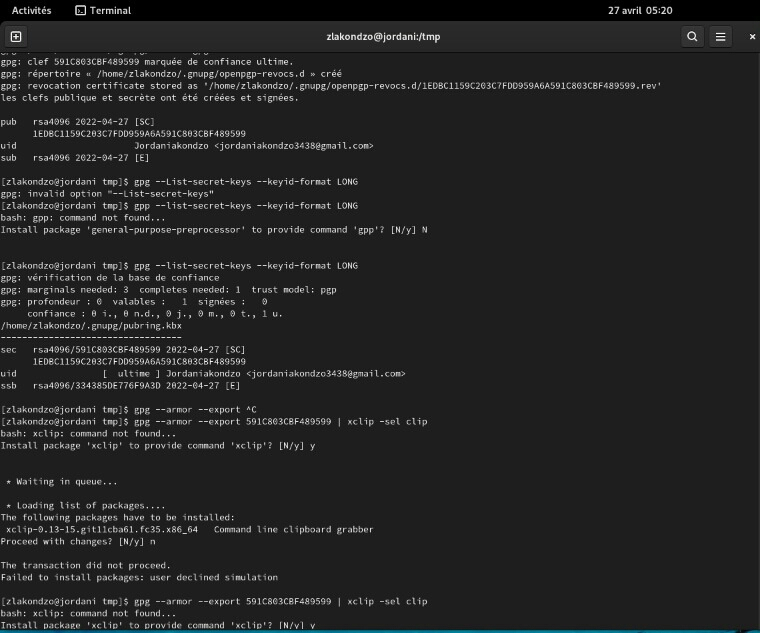{ #fig:007 width=70% }

7. Настройка автоматических подписей коммитов git

  - Настроил автоматические подписи коммитов git: (рис. [-@fig:008])
    
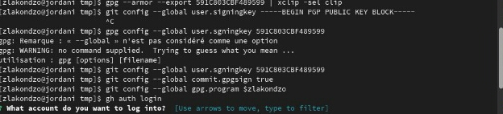{ #fig:008 width=70% }

8. Настройка gh

   - Затем настроил gh (рис. [-@fig:009], [-@fig:010])
    
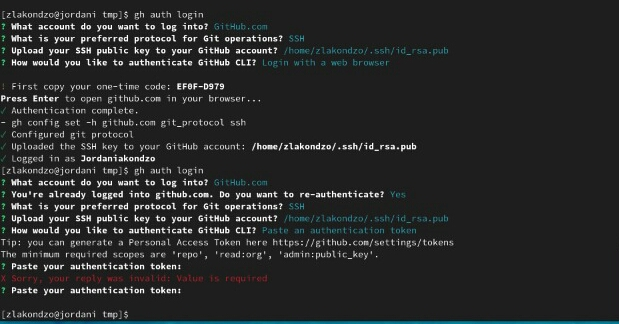{ #fig:009 width=70% }

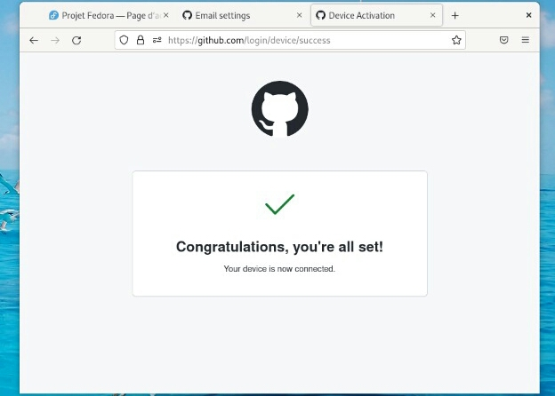{ #fig:010 width=70% }

9. Создание репозитория курса на основе шаблона

  - Создал шаблон рабочего пространства (рис. [-@fig:011])
    
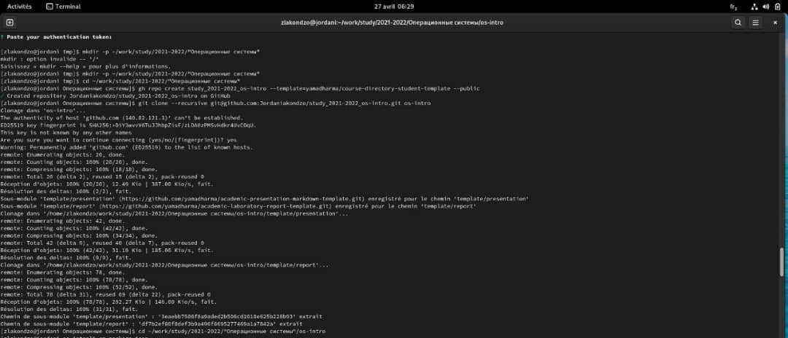{ #fig:011 width=70% }

10. Настройка каталога курса

   - Перейдил в катог курса.
    
   - Удалил лишние файлы.
   
   - Создал необходимо каталоги. 
    (рис. [-@fig:012])
    
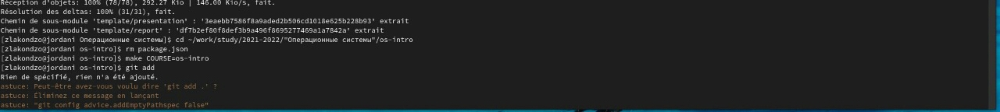{ #fig:012 width=70% }

   - Отправил файлы на сервер. (рис. [-@fig:013], [-@fig:014])
    
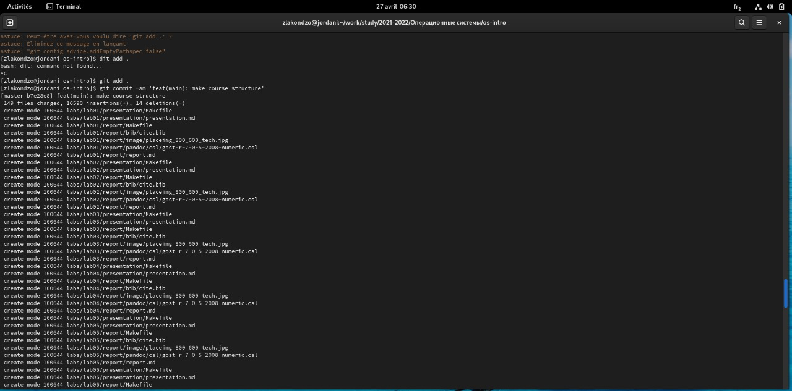{ #fig:013 width=70% }

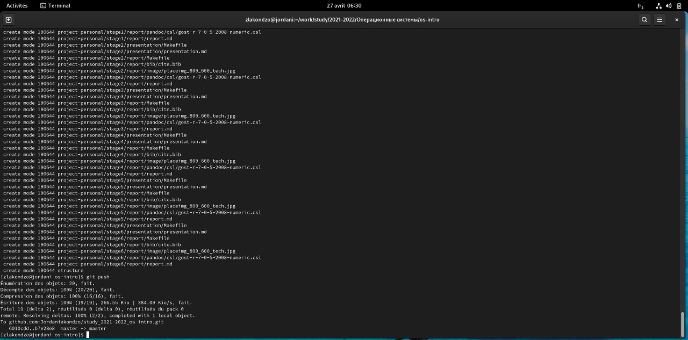{ #fig:014 width=70% }

# Выводы

Таким образом, мы только что создали репозиторий курса "Операционные Системы", основанный на шаблоне профессора на github. Это позволит всем студентам класса а одновременно работать над одним проектом.

# Контрольные вопросы

1. **Что такое системы контроля версий (VCS) и для решения каких задач они предназначаются?**

    - Система контроля версий (VCS) - программное обеспечение для облегчения работы с изменяющейся информацией. Система управления версиями позволяет хранить несколько версий одного и того же документа, при необходимости возвращаться к более ранним версиям, определять, кто и когда сделал то или иное изменение, и многое другое.
    - Такие системы наиболее широко используются при разработке программного обеспечения для хранения исходных кодов разрабатываемой программы. Однако они могут с успехом применяться и в других областях, в которых ведётся работа с большим количеством непрерывно изменяющихся электронных документов.
    
2. **Объясните следующие понятия VCS и их отношения: хранилище, commit, история, рабочая копия.**

    - Хранилище – репозиторий - место хранения всех версий и служебной информации.
    - Commit - это команда для записи индексированных изменений в репозиторий.
    - История – место, где сохраняются все коммиты, по которым можно посмотреть данные о коммитах.
    - Рабочая копия – текущее состояние файлов проекта, основанное на версии, загруженной из хранилища.
    
3. **Что представляют собой и чем отличаются централизованные и децентрализованные VCS? Приведите примеры VCS каждого вида.**

    - Централизованные системы – это системы, в которых одно основное хранилище всего проекта, и каждый пользователь копирует необходимые ему файлы, изменяет и вставляет обратно.
    - Пример – Subversion.
    - Децентрализованные системы – система, в которой каждый пользователь имеет свой вариант репозитория и есть возможность добавлять и забирать изменения из репозиториев. 
    - Например, Git.

4. **Опишите действия с VCS при единоличной работе с хранилищем.**

    - Сначала сделаем предварительную конфигурацию, указав имя и email владельца репозитория: 1 git config --global user.name "Имя Фамилия" 2 git config --global user.email "work@mail" и настроив utf-8 в выводе сообщений git: 1 git config --global quotepath false Для инициализации локального репозитория, расположенного, например, в каталоге ~/tutorial, необходимо ввести в командной строке: Кулябов Д. С. и др. Операционные системы 25 1 cd 2 mkdir tutorial 3 cd tutorial 4 git init После это в каталоге tutorial появится каталог .git, в котором будет храниться история изменений. Создадим тестовый текстовый файл hello.txt и добавим его в локальный репозиторий: 
   1. echo 'hello world' > hello.txt 
   2. git add hello.txt 
   3. git commit -am 'Новый файл' 
    - Воспользуемся командой status для просмотра изменений в рабочем каталоге, сделанных с момента последней ревизии: 1 git status Во время работы над проектом так или иначе могут создаваться файлы, которые не требуется добавлять в последствии в репозиторий. Например, временные файлы, создаваемые редакторами, или объектные файлы, создаваемые компиляторами.
    - Можно прописать шаблоны игнорируемых при добавлении в репозиторий типов файлов в файл .gitignore с помощью сервисов. Для этого сначала нужно получить список имеющихся шаблонов: 
   1. curl -L -s https://www.gitignore.io/api/list 
Затем скачать шаблон, например, для C и C++ 
   1. curl -L -s https://www.gitignore.io/api/c >> .gitignore 
   2. curl -L -s https://www.gitignore.io/api/c++ >> .gitignore

5. **Опишите порядок работы с общим хранилищем VCS.**

    - Для последующей идентификации пользователя на сервере репозиториев необходимо сгенерировать пару ключей (приватный и открытый): 
   1. ssh-keygen -C "Имя Фамилия " 
    - Ключи сохраняться в каталоге ~/.ssh/. Существует несколько доступных серверов репозиториев с возможностью бесплатного размещения данных. Например, https://github.com/. Для работы с ним необходимо сначала завести на сайте https://github.com/ учётную запись. Затем необходимо загрузить сгенерённый нами ранее открытый ключ. Для этого зайти на сайт https://github.com/ под своей учётной записью и перейти в меню GitHub setting . После этого выбрать в боковом меню GitHub setting SSH-ключи и нажать кнопку Добавить ключ . Скопировав из локальной консоли ключ в буфер обмена
   1. cat ~/.ssh/id_rsa.pub | xclip -sel clip 
    - И так вставляем ключ в появившееся на сайте поле. После этого можно создать на сайте репозиторий, выбрав в меню Репозитории Создать репозиторий , дать ему название и сделать общедоступным (публичным). Для загрузки репозитория из локального каталога на сервер выполняем следующие команды: 1 git remote add origin 
   2. ssh://git@github.com//.git 
   3. git push -u origin master 
    - Далее на локальном компьютере можно выполнять стандартные процедуры для работы с git при наличии центрального репозитория.

6. **Каковы основные задачи, решаемые инструментальным средством git?**

    - У Git две основных задачи:
   1. Первая — хранить информацию обо всех изменениях в вашем коде, начиная с самой первой строчки, 
   2. А вторая — обеспечение удобства командной работы над кодом.
    
7. **Назовите и дайте краткую характеристику командам git.**

| **Команда**                  |**Описание действия**                                                                                                       |
|------------------------------|----------------------------------------------------------------------------------------------------------------------------|
| `git init`                   | создание основного дерева репозитория                                                                                      |
| `git pull `                  | получение обновлений (изменений) текущего дерева из центрального репозитория                                               |
| `git status`                 | просмотр списка изменённых файлов в текущей директории                                                                     |
| `git push`                   | отправка всех произведённых изменений локального дерева в центральный репозиторий                                          |
| `git diff`                   | просмотр текущих изменения                                                                                                 |
| `git add .`                  | добавить все изменённые и/или созданные файлы и/или каталоги                                                               |
| `git add имена_файлов`       | добавить конкретные изменённые и/или созданные файлы и/или каталоги                                                        |
| `git rm имена_файлов`        | удалить файл и/или каталог из индекса репозитория (при этом файл и/или каталог                                             |
|                              | остаётся в локальной директории)                                                                                           |
| `git commit -am 'Коммит'`    | сохранить все добавленные изменения и все изменённые файлы                                                                 |
| `git commit`                 | сохранить добавленные изменения с внесением комментария через встроенный                                                   |
|                              | редактор                                                                                                                   |
| `git checkout -b имя_ветки`  | создание новой ветки, базирующейся на текущей                                                                              |
| `git checkout имя_ветки`     | переключение на некоторую ветку                                                                                            |
| `git push origin имя_ветки`  | отправка изменений конкретной ветки в центральный репозиторий                                                              |
| `git branch -d имя_ветки`    | удаление локальной уже слитой с основным деревом ветки                                                                     |
| `git branch -D имя_ветки`    | принудительное удаление локальной ветки                                                                                    |
| `git push origin :имя_ветки` | удаление ветки с центрального репозитория                                                                                  |

8. **Приведите примеры использования при работе с локальным и удалённым репозиториями**

    - Для инициализации локального репозитория, расположенного, например, в каталоге ~/tutorial, необходимо ввести в командной строке: 
   1. cd 
   2. mkdir tutorial 
   3. cd tutorial 
   4. git init 
    - После это в каталоге tutorial появится каталог .git, в котором будет храниться история изменений. Создадим тестовый текстовый файл hello.txt и добавим его в локальный репозиторий: 
   1. echo 'hello world' > hello.txt 
   2. git add hello.txt 3 git commit -am 'Новый файл' 
    Воспользуемся командой status для просмотра изменений в рабочем каталоге, сделанных с момента последней ревизии: 
   1. git status

9. **Что такое и зачем могут быть нужны ветви (branches)?**

    - Ветка (англ. branch) — это последовательность коммитов, в которой ведётся параллельная разработка какого-либо функционала. Ветки нужны, чтобы несколько программистов могли вести работу над одним и тем же проектом или даже файлом одновременно, при этом не мешая друг другу. Кроме того, ветки используются для тестирования экспериментальных функций: чтобы не повредить основному проекту, создается новая ветка специально для экспериментов.
    
10. **Как и зачем можно игнорировать некоторые файлы при commit?**

    - Игнорируемые файлы — это, как правило, артефакты сборки и файлы, генерируемые машиной из исходных файлов в вашем репозитории, либо файлы, которые по какой-либо иной причине не должны попадать в коммиты. В Git нет специальной команды для указания игнорируемых файлов: вместо этого необходимо вручную отредактировать файл .
    - Временно игнорировать изменения в файле можно с командой git update-index-assumeunchanged<file>

    

::: {#refs}
:::
