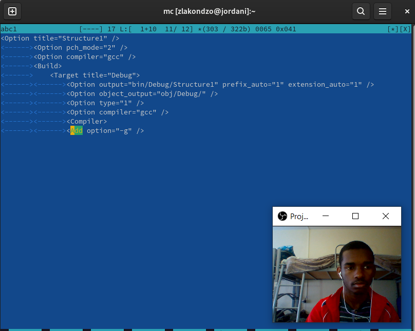
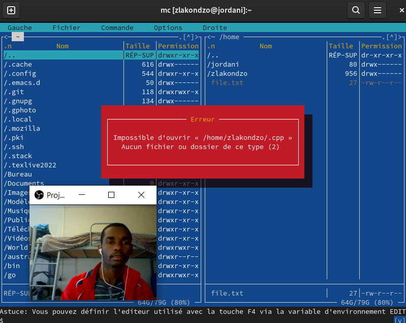
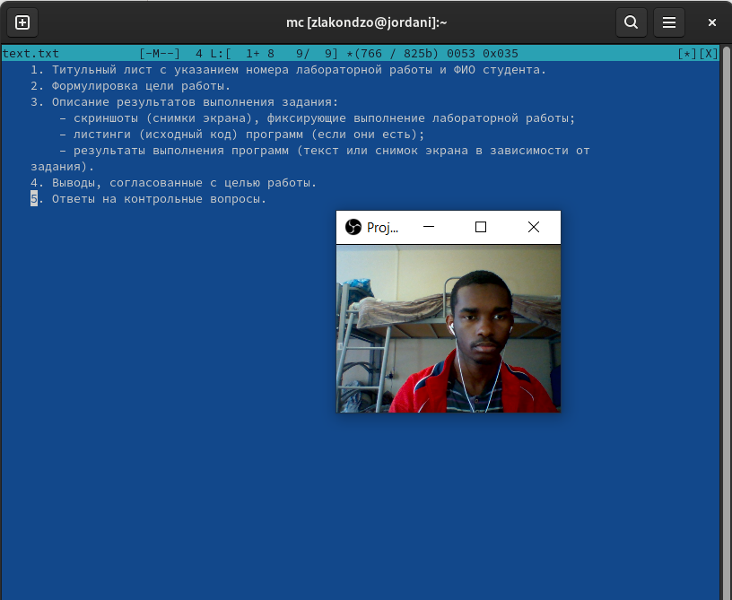

---
## Front matter
title: "Отчёт по лабораторной работе №7"
subtitle: "НКНбд-02-21"
author: "Акондзо Жордани Лади Гаэл"

## Generic otions
lang: ru-RU
toc-title: "Содержание"

## Bibliography
bibliography: bib/cite.bib
csl: pandoc/csl/gost-r-7-0-5-2008-numeric.csl

## Pdf output format
toc: true # Table of contents
toc-depth: 2
lof: true # List of figures
lot: true # List of tables
fontsize: 12pt
linestretch: 1.5
papersize: a4
documentclass: scrreprt
## I18n polyglossia
polyglossia-lang:
  name: russian
  options:
	- spelling=modern
	- babelshorthands=true
polyglossia-otherlangs:
  name: english
## I18n babel
babel-lang: russian
babel-otherlangs: english
## Fonts
mainfont: PT Serif
romanfont: PT Serif
sansfont: PT Sans
monofont: PT Mono
mainfontoptions: Ligatures=TeX
romanfontoptions: Ligatures=TeX
sansfontoptions: Ligatures=TeX,Scale=MatchLowercase
monofontoptions: Scale=MatchLowercase,Scale=0.9
## Biblatex
biblatex: true
biblio-style: "gost-numeric"
biblatexoptions:
  - parentracker=true
  - backend=biber
  - hyperref=auto
  - language=auto
  - autolang=other*
  - citestyle=gost-numeric
## Pandoc-crossref LaTeX customization
figureTitle: "Рис."
tableTitle: "Таблица"
listingTitle: "Листинг"
lofTitle: "Список иллюстраций"
lotTitle: "Список таблиц"
lolTitle: "Листинги"
## Misc options
indent: true
header-includes:
  - \usepackage{indentfirst}
  - \usepackage{float} # keep figures where there are in the text
  - \floatplacement{figure}{H} # keep figures where there are in the text
---

# Цель работы:

Цель данного работы --- Освоение основных возможностей командной оболочки Midnight Commander. Приобретение навыков практической работы по просмотру каталогов и файлов; манипуляций
с ними.

# Задание:

## Задание по mc:

1. Изучите информацию о mc, вызвав в командной строке man mc.

2. Запустите из командной строки mc, изучите его структуру и меню.

   Ctrl-y - удалить строку
   
   Ctrl-u - отмена последней операции
   
   Ins - вставка/замена
   
   F7 - поиск (можно использовать регулярные выражения)
   
   -F7 - повтор последней операции поиска
   
   F4 - замена
   
   F3 - первое нажатие — начало выделения, второе — окончание
выделения

   F5 - копировать выделенный фрагмент
   
   F6 - переместить выделенный фрагмент
   
   F8 - удалить выделенный фрагмент
   
   F2 - записать изменения в файл
   
   F10 - выйти из редактора
   
3. Выполните несколько операций в mc, используя управляющие клавиши (операции
с панелями; выделение/отмена выделения файлов, копирование/перемещение файлов, получение информации о размере и правах доступа на файлы и/или каталоги
и т.п.)

4. Выполните основные команды меню левой (или правой) панели. Оцените степень подробности вывода информации о файлах.

5. Используя возможности подменю Файл , выполните:

   Просмотр содержимого текстового файла;
   
   Редактирование содержимого текстового файла (без сохранения результатов редактирования);

   Создание каталога;
   
   Копирование в файлов в созданный каталог.
       
6. С помощью соответствующих средств подменю Команда осуществите:

    - поиск в файловой системе файла с заданными условиями (например, файла с расширением .c или .cpp, содержащего строку main);

 - выбор и повторение одной из предыдущих команд;
       
 - переход в домашний каталог;
       
 - анализ файла меню и файла расширений.
       
7. Вызовите подменю Настройки . Освойте операции, определяющие структуру экрана mc
(Full screen, Double Width, Show Hidden Files и т.д.).

### Задание по встроенному редактору mc:

1. Создайте текстовой файл text.txt.

2. Откройте этот файл с помощью встроенного в mc редактора.

3. Вставьте в открытый файл небольшой фрагмент текста, скопированный из любого
другого файла или Интернета.

4. Проделайте с текстом следующие манипуляции, используя горячие клавиши:

   4.1. Удалите строку текста.
   
   4.2. Выделите фрагмент текста и скопируйте его на новую строку.
   
   4.3. Выделите фрагмент текста и перенесите его на новую строку.
   
   4.4. Сохраните файл.
   
   4.5. Отмените последнее действие.
   
   4.6. Перейдите в конец файла (нажав комбинацию клавиш) и напишите некоторый
текст.

   4.7. Перейдите в начало файла (нажав комбинацию клавиш) и напишите некоторый
текст.

   4.8. Сохраните и закройте файл.
       
5. Откройте файл с исходным текстом на некотором языке программирования (напри-
мер C или Java)

6. Используя меню редактора, включите подсветку синтаксиса, если она не включена,
или выключите, если она включена.

# Теоретическое введение:

Командная оболочка — интерфейс взаимодействия пользователя с операционной систе-
мой и программным обеспечением посредством команд.
Midnight Commander (или mc) — псевдографическая командная оболочка для UNIX/Linux
систем. Для запуска mc необходимо в командной строке набрать mc и нажать Enter .
Рабочее пространство mc имеет две панели, отображающие по умолчанию списки
файлов двух каталогов.
Над панелями располагается меню, доступ к которому осуществляется с помощью
клавиши F9 . Под панелями внизу расположены управляющие экранные кнопки, ассоци-
ированные с функциональными клавишами F1 – F10. Над ними располагается
командная строка, предназначенная для ввода команд.

Например, в табл. [-@tbl:std-dir] приведено краткое описание стандартных каталогов Unix.

: Описание некоторых каталогов файловой системы GNU Linux {#tbl:std-dir}

| **Команда**                  |**Описание действия**                                                                                                       |
|------------------------------|---------------------------------------------------------------------------------------------
| `F1`                         |      Вызов контекстно-зависимой подсказки                         |
| `F2`                         |  Вызов пользовательского меню с возможностью создания и/или дополнения дополнительных функций   |
| `F3`                         |  Просмотр содержимого файла, на который указывает подсветка в активной панели (без возможности редактирования)                                   |
| `F4`                         | Вызов встроенного в mc редактора для изменения содержания файла, на который указывает подсветка в активной панели |
| `F5`                         | Копирование одного или нескольких файлов, отмеченных в первой (активной) панели, в каталог, отображаемый на второй панели                                                                              |
| `F6`                         | Перенос одного или нескольких файлов, отмеченных в первой (активной) панели, в каталог, отображаемый на второй панели |
| `F7`                         | Создание подкаталога в каталоге, отображаемом в активной панели                                                                           |
| `F8`                         | Удаление одного или нескольких файлов (каталогов), отмеченных в первой (активной) панели файлов                                                                                                         |
| `F9`                         |    Вызов меню mc                                                               |
| `F10`                        | Выход из mc |

# Ход работы:

##  Задание по mc: 

1. Изучение информации о mc, вызвав в командной строке man mc  (рис. [-@fig:001])

{#fig:001 width=70% }

2. Запустение из командной строки mc, изучение его структуру и меню.

   Ctrl-y - удалить строку. (рис. [-@fig:002])

{#fig:002 width=70% }

   Ctrl-u - отмена последней операции. (рис. [-@fig:003])
   
{#fig:003 width=70% } 

   F7 - поиск (можно использовать регулярные выражения). (рис. [-@fig:004])
   
{#fig:004 width=70% }

{width=70% } 

   F4 - замена. (рис. [-@fig:005])
 
{#fig:005 width=70% }

{width=70% }
{width=70% }

   F3 - первое нажатие — начало выделения, второе — окончание
выделения. (рис. [-@fig:006])

{#fig:006 width=70% }

   F5 - копировать выделенный фрагмент.
   
{ width=70% }

   F6 - переместить выделенный фрагмент.

{ width=70% }

   F8 - удалить выделенный фрагмент.

{width=70% }

   F2 - записать изменения в файл.

{width=70% }

   F10 - выйти из редактора.

{width=70% }

3. Выполнил несколько операций в mc, используя управляющие клавиши (операции
с панелями; выделение/отмена выделения файлов, копирование/перемещение файлов, получение информации о размере и правах доступа на файлы и/или каталоги и т.п.) с помощью клавиши F3, F5, F6 и ALt+t.

{ width=70% }

{ width=70% }
{ width=70% }

{ width=70% }

{ width=70% }

4. Я выполнил основные команды меню левой (или правой) панели. Оценил степень
подробности вывода информации о файлах. (рис. [-@fig:007])

{#fig:007 width=70% }

5. Используя возможности подменю Файл, я выполнил:

   Просмотр содержимого текстового файла; 
   
{width=70% }

   Редактирование содержимого текстового файла (без сохранения результатов редактирования); 
   
{ width=70% } 

   Создание каталога;

{ width=70% }

   Копирование в файлов в созданный каталог.

{ width=70% }

6. С помощью соответствующих средств подменю команда, я осуществил:

  Поиск в файловой системе файла с заданными условиями (например, файла с расширением .c или .cpp, содержащего строку main);

{ width=70% }
 
  Выбор и повторение одной из предыдущих команд;

{width=70% }

7. Вызовил подменю Настройки . Освойте операции, определяющие структуру экрана mc
(Full screen, Double Width, Show Hidden Files и т.д.).

 (рис. [-@fig:008])

{#fig:008 width=70% }

{ width=70% }

{ width=70% }

### Задание по встроенному редактору mc:

1. Я создал текстовой файл text.txt. (рис. [-@fig:009])

{#fig:009 width=70% }

2. Открыл этот файл с помощью встроенного в mc редактора. (рис. [-@fig:010])

{#fig:010 width=70% }

3. Вставил в открытый файл небольшой фрагмент текста, скопированный из любого
другого файла или Интернета. (рис. [-@fig:011])

{#fig:011 width=70% }

4. Проделал с текстом следующие манипуляции, используя горячие клавиши:

4.1. Удалил строку текста. (рис. [-@fig:012])

{#fig:012 width=70% }

4.2. Выделил фрагмент текста и скопируйте его на новую строку. (рис. [-@fig:013])

{#fig:013 width=70% }

4.3. Выделил фрагмент текста и перенесите его на новую строку. (рис. [-@fig:014])

{#fig:014 width=70% }

4.4. Сохранил файл с помощью клавиши F2.

4.5. Отменил последнее действие с помощью клавиши ctrl+u.
 
4.6. Перейдип в конец файла (нажав комбинацию клавиш) и напишите некоторый
текст с помощью клавиши ctrl+end. (рис. [-@fig:015])

{#fig:015 width=70% }

4.7. Перейдите в начало файла (нажав комбинацию клавиш) и напишите некоторый
текст с помощью клавиши ctrl+home. (рис. [-@fig:016])

{#fig:016 width=70% }

4.8. Сохраните и закройте файл с помощью клавиши F2 и F10.

5. Открыл файл с исходным текстом на некотором языке программирования так как python3. (рис. [-@fig:017])

{#fig:017 width=70% }

6. Используя меню редактора, включил подсветку синтаксиса, потому что, она не включена. (рис. [-@fig:018])

{#fig:018 width=70% }

# Выводы:

Мы научились пользоваться основных возможностей командной оболочки Midnight Commander. Приобрели навыков практической работы по просмотру каталогов и файлов; манипуляций с ними.

# Контрольные вопросы

1. **Какие режимы работы есть в mc. Охарактеризуйте их.**

В mc есть некоторые режимы, и можно эти узнать с помощью команды man mc.

2. **Какие операции с файлами можно выполнить как с помощью команд shell, так и с помощью меню (комбинаций клавиш) mc? Приведите несколько примеров.**

   mc и понажимать от F1 до F10, так как:
   
    - F3 - Просмотр содержимого файла, на который указывает подсветка в активной панели (без возможности редактирования);

    - F4 - Вызов встроенного в mc редактора для изменения содержания файла, на который указывает подсветка в активной панели;

    - F5 - Копирование одного или нескольких файлов, отмеченных в первой (активной) панели, в каталог, отображаемый на второй панели;

    - F6 - Перенос одного или нескольких файлов, отмеченных в первой (активной) панели, в каталог, отображаемый на второй панели.

3. **Опишите структура меню левой (или правой) панели mc, дайте характеристику командам.**

   Подпункт меню Информация позволяет посмотреть информацию о файле или каталоге.
В меню каждой (левой или правой) панели можно выбрать Формат списка :

    - Стандартный — выводит список файлов и каталогов с указанием размера и времени
правки;

    - Ускоренный — позволяет задать число столбцов, на которые разбивается панель при
выводе списка имён файлов или каталогов без дополнительной информации;

    - Расширенный — помимо названия файла или каталога выводит сведения о правах
доступа, владельце, группе, размере, времени правки;

    -  Определённый пользователем — позволяет вывести те сведения о файле или каталоге, которые задаст сам пользователь.

    - Подпункт меню Порядок сортировки позволяет задать критерии сортировки при выводе списка файлов и каталогов: без сортировки, по имени, расширенный, время правки, время доступа, время изменения атрибута, размер, узел.

4. **Опишите структура меню Файл mc, дайте характеристику командам.**

   В меню Файл содержит перечень команд, которые могут быть применены к одному
или нескольким файлам или каталогам.
Команды меню Файл :

    - Просмотр ( F3 ) — позволяет посмотреть содержимое текущего (или выделенного) файла без возможности редактирования.

    - Просмотр вывода команды ( М + ! ) — функция запроса команды с параметрами (аргумент к текущему выбранному файлу).

    - Правка ( F4 ) — открывает текущий (или выделенный) файл для его редактирования.
   
    - Копирование ( F5 ) — осуществляет копирование одного или нескольких файлов или каталогов в указанное пользователем во всплывающем окне место.

    - Права доступа ( Ctrl-x c ) — позволяет указать (изменить) права доступа к одному или нескольким файлам или каталога.

5. **Опишите структура меню Команда mc, дайте характеристику командам.**

   В меню Команда содержатся более общие команды для работы с mc.
Команды меню Команда :

    - Дерево каталогов — отображает структуру каталогов системы.
       
    - Поиск файла — выполняет поиск файлов по заданным параметрам.
       
    - Переставить панели — меняет местами левую и правую панели.
       
    - Сравнить каталоги ( Ctrl-x d ) — сравнивает содержимое двух каталогов.
       
    - Размеры каталогов — отображает размер и время изменения каталога (по умолчанию в mc размер каталога корректно не отображается).

    - История командной строки — выводит на экран список ранее выполненных в оболочке команд.
       
    - Каталоги быстрого доступа ( Ctrl-\ ) — пр вызове выполняется быстрая смена текущего каталога на один из заданного списка.

    - Восстановление файлов — позволяет восстановить файлы на файловых системах ext2
и ext3.
    - Редактировать файл расширений — позволяет задать с помощью определённого синтаксиса действия при запуске файлов с определённым расширением (например, какое программного обеспечение запускать для открытия или редактирования файлов с расширением doc или docx).
       
    - Редактировать файл меню — позволяет отредактировать контекстное меню пользователя, вызываемое по клавише F2.
       
    - Редактировать файл расцветки имён — позволяет подобрать оптимальную для пользователя расцветку имён файлов в зависимости от их типа.

6. **Опишите структура меню Настройки mc, дайте характеристику командам.**

   Меню Настройки содержит ряд дополнительных опций по внешнему виду и функциональности mc.

   Меню Настройки содержит:
   
    - Конфигурация — позволяет скорректировать настройки работы с панелями.
       
    - Внешний вид и Настройки панелей — определяет элементы (строка меню, командная строка, подсказки и прочее), отображаемые при вызове mc, а также геометрию расположения панелей и цветовыделение.

    - Биты символов — задаёт формат обработки информации локальным терминалом.
       
    - Подтверждение — позволяет установить или убрать вывод окна с запросом подтверждения действий при операциях удаления и перезаписи файлов, а также при выходе из программы.

    - Распознание клавиш — диалоговое окно используется для тестирования функциональных клавиш, клавиш управления курсором и прочее.
       
    - Виртуальные ФС –– настройки виртуальной файловой системы: тайм-аут, парольи прочее.
    
7. **Назовите и дайте характеристику встроенным командам mc.**

8. **Назовите и дайте характеристику командам встроенного редактора mc.**

   Встроенный в mc редактор вызывается с помощью функциональной клавиши F4 . В нём
удобно использовать различные комбинации клавиш при редактировании содержимого
(как правило текстового) файла.

9. **Дайте характеристику средствам mc, которые позволяют создавать меню, определяемые пользователем.**

Правка ( F4 ) — открывает текущий (или выделенный) файл для его редактирования.

10. **Дайте характеристику средствам mc, которые позволяют выполнять действия, определяемые пользователем, над текущим файлом.**

    shift+insert

::: {#refs}
:::
