---
## Front matter
title: "Отчёт по лабораторной работе №8"
subtitle: "НКНбд-02-21"
author: "Акондзо Жордани Лади Гаэл"

## Generic otions
lang: ru-RU
toc-title: "Содержание"

## Bibliography
bibliography: bib/cite.bib
csl: pandoc/csl/gost-r-7-0-5-2008-numeric.csl

## Pdf output format
toc: true # Table of contents
toc-depth: 2
lof: true # List of figures
lot: true # List of tables
fontsize: 12pt
linestretch: 1.5
papersize: a4
documentclass: scrreprt
## I18n polyglossia
polyglossia-lang:
  name: russian
  options:
	- spelling=modern
	- babelshorthands=true
polyglossia-otherlangs:
  name: english
## I18n babel
babel-lang: russian
babel-otherlangs: english
## Fonts
mainfont: PT Serif
romanfont: PT Serif
sansfont: PT Sans
monofont: PT Mono
mainfontoptions: Ligatures=TeX
romanfontoptions: Ligatures=TeX
sansfontoptions: Ligatures=TeX,Scale=MatchLowercase
monofontoptions: Scale=MatchLowercase,Scale=0.9
## Biblatex
biblatex: true
biblio-style: "gost-numeric"
biblatexoptions:
  - parentracker=true
  - backend=biber
  - hyperref=auto
  - language=auto
  - autolang=other*
  - citestyle=gost-numeric
## Pandoc-crossref LaTeX customization
figureTitle: "Рис."
tableTitle: "Таблица"
listingTitle: "Листинг"
lofTitle: "Список иллюстраций"
lotTitle: "Список таблиц"
lolTitle: "Листинги"
## Misc options
indent: true
header-includes:
  - \usepackage{indentfirst}
  - \usepackage{float} # keep figures where there are in the text
  - \floatplacement{figure}{H} # keep figures where there are in the text
---

# Цель работы

Цель данного работы --- Познакомиться с операционной системой Linux. Получить практические навыки рабо-
ты с редактором vi, установленным по умолчанию практически во всех дистрибутивах.

# Последовательность выполнения работы

1. Ознакомиться с теоретическим материалом.

2. Ознакомиться с редактором vi.

3. Выполнить упражнения, используя команды vi.

## Задание 1. Создание нового файла с использованием vi

1. Создайте каталог с именем ~/work/os/lab06.

2. Перейдите во вновь созданный каталог.

3. Вызовите vi и создайте файл hello.sh

   vi hello.sh
   
4. Нажмите клавишу i и вводите следующий текст.

 #!/bin/bash
  HELL=Hello
  function hello {
     LOCAL HELLO=World
     echo $HELLO
}
echo $HELLO
hello

5. Нажмите клавишу Esc для перехода в командный режим после завершения ввода текста.

6. Нажмите : для перехода в режим последней строки и внизу вашего экрана появится приглашение в виде двоеточия.

7. Нажмите w (записать) и q (выйти), а затем нажмите клавишу Enter для сохранения вашего текста и завершения работы.

8. Сделайте файл исполняемым:

 chmod +x hello.sh
 
## Задание 2. Редактирование существующего файла

1. Вызовите vi на редактирование файла:

   vi ~/work/os/lab06/hello.sh
   
2. Установите курсор в конец слова HELL второй строки.

3. Перейдите в режим вставки и замените на HELLO. Нажмите Esc для возврата в командный режим.

4. Установите курсор на четвертую строку и сотрите слово LOCAL.

5. Перейдите в режим вставки и наберите следующий текст: local, нажмите Esc для возврата в командный режим.

6. Установите курсор на последней строке файла. Вставьте после неё строку, содержащую следующий текст: echo $HELLO.

7. Нажмите Esc для перехода в командный режим.

8. Удалите последнюю строку.

9. Введите команду отмены изменений u для отмены последней команды.

10. Введите символ : для перехода в режим последней строки. Запишите произведённые изменения и выйдите из vi.

# Теоретическое введение

В большинстве дистрибутивов Linux в качестве текстового редактора по умолчанию устанавливается интерактивный экранный редактор vi (Visual display editor).
Редактор vi имеет три режима работы:
– командный режим — предназначен для ввода команд редактирования и навигации по редактируемому файлу;
– режим вставки — предназначен для ввода содержания редактируемого файла;
– режим последней (или командной) строки — используется для записи изменений в файл и выхода из редактора.
Для вызова редактора vi необходимо указать команду vi и имя редактируемого файла:
vi <имя_файла>
При этом в случае отсутствия файла с указанным именем будет создан такой файл.
Переход в командный режим осуществляется нажатием клавиши Esc . Для выхода из редактора vi необходимо перейти в режим последней строки: находясь в командном режиме, нажать Shift-; (по сути символ : — двоеточие), затем:
– набрать символы wq, если перед выходом из редактора требуется записать изменения
в файл;
– набрать символ q (или q!), если требуется выйти из редактора без сохранения.

Например, в табл. [-@tbl:std-dir] приведено краткое описание стандартных каталогов Unix.

: Описание некоторых каталогов файловой системы GNU Linux {#tbl:std-dir}

| **Команда**                  |**Описание действия**                                                                                                       |
|------------------------------|--------------------------------------------------------------------------------------------
| `0 (ноль)`                   |  переход в начало строки                                                            |
| `$ `                         | переход в конец строки   |
| `G`                          |  переход в конец файла                              |
| `nG`                         | переход на строку с номером n. |
| `ctrl+d`                     | перейти на пол-экрана вперёд                                                                          |
| `ctrl+u`                     | перейти на пол-экрана назад |
 `ctrl+f`                      | перейти на страницу вперёд                                                                        |
| `ctrl+b`                     |  перейти на страницу
назад.                                                                                             |
| `W или w`                    | перейти на слово вперёд

Конечно, есть еще несколько команд, которые очень полезных для рабрты с редактором Vi, но мы написали только некоторые из них, чтобы заполнить нашу табличу. 

# Ход работы:

## Задание 1:

1. Я создал каталог с именем ~/work/os/lab06. (рис. [-@fig:001])

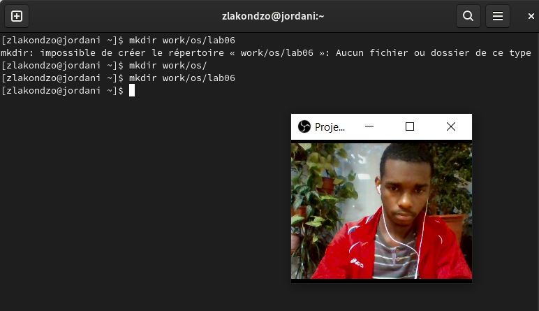{#fig:001 width=70% }

2. Установил во вновь созданный каталог. 

3. Вызвал vi и создал файл hello.sh (vi hello.sh). (рис. [-@fig:002])

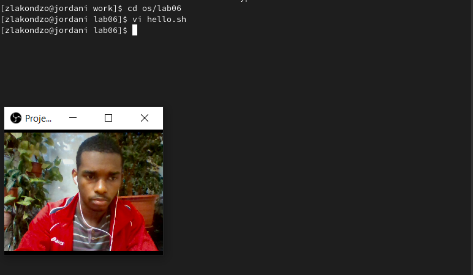{#fig:002 width=70% }

4. Нажал клавишу i и вводите следующий текст: (рис. [-@fig:003])

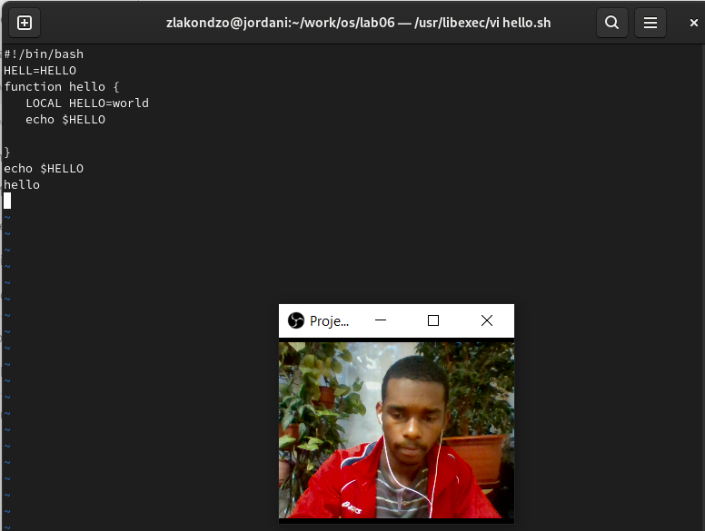{#fig:003 width=70% }

5. Нажал клавишу Esc для перехода в командный режим после завершения ввода
текста.

6. Нажал : для перехода в режим последней строки и внизу вашего экрана появится
приглашение в виде двоеточия.

7. Нажал w (записать) и q (выйти), а затем нажмите клавишу Enter для сохранения
моего текста и завершения работы. (рис. [-@fig:004], [-@fig:005] )

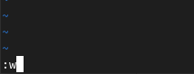{#fig:004 width=70% }

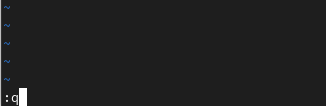{#fig:005 width=70% }

8. Сделал файл исполняемым. (рис. [-@fig:006])

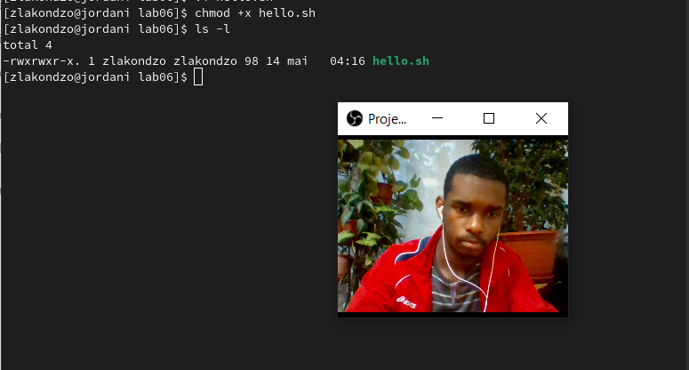{#fig:006 width=70% }

## Задание 2:

1. Вызвал vi на редактирование файла: vi ~/work/os/lab06/hello.sh. (рис. [-@fig:007])

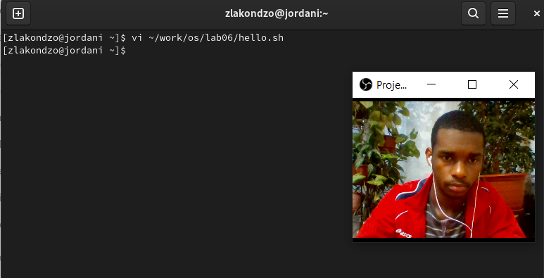{#fig:007 width=70% }

2. Установил курсор в конец слова HELL второй строки. (рис. [-@fig:008])

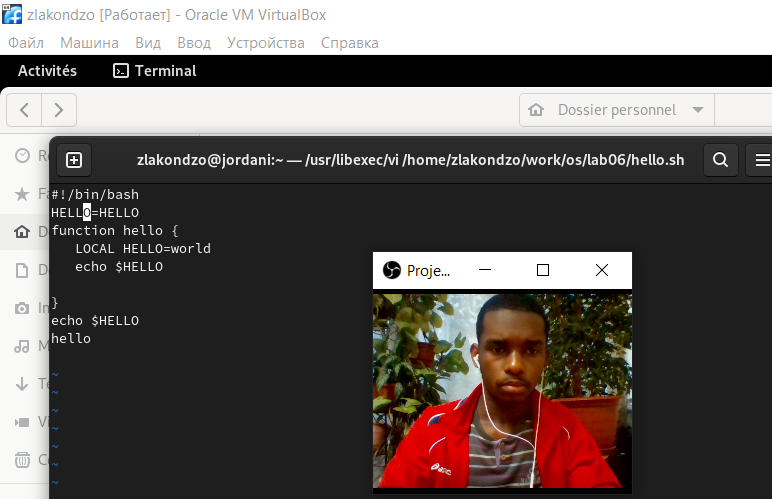{#fig:008 width=70% }

3. Перешёл в режим вставки и замените на HELLO. Нажал Esc для возврата в командный режим. (рис. [-@fig:009])

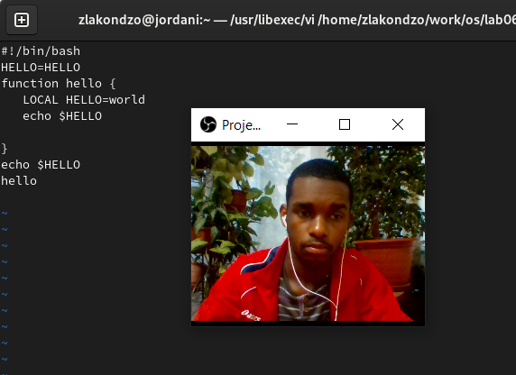{#fig:009 width=70% }

4. Установил курсор на четвертую строку и сотрите слово LOCAL. (рис. [-@fig:010])

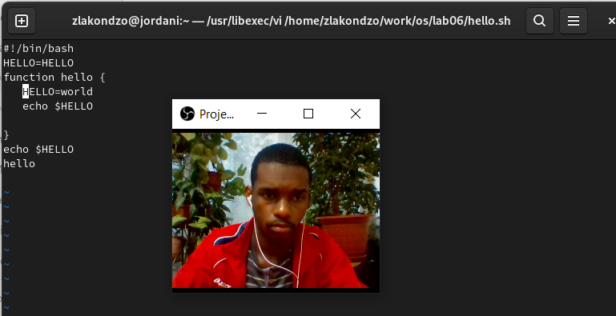{#fig:010 width=70% }

5. Перешёл в режим вставки и наберите следующий текст: local, нажал Esc для возврата в командный режим. (рис. [-@fig:011])

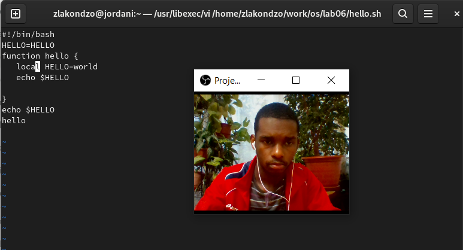{#fig:011 width=70% }

6. Установил курсор на последней строке файла. Вставил после неё строку, содержащую следующий текст: echo $HELLO. (рис. [-@fig:012])

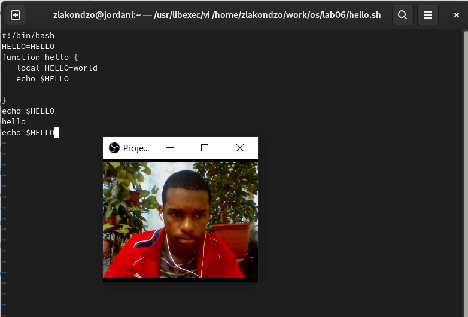{#fig:012 width=70% }

7. Нажал Esc для перехода в командный режим. 

8. Удалил последнюю строку. (рис. [-@fig:013])

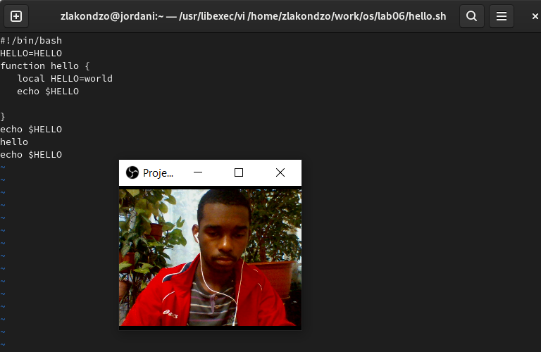{#fig:013 width=70% }

9. Ввёл команду отмены изменений u для отмены последней команды. (рис. [-@fig:014])

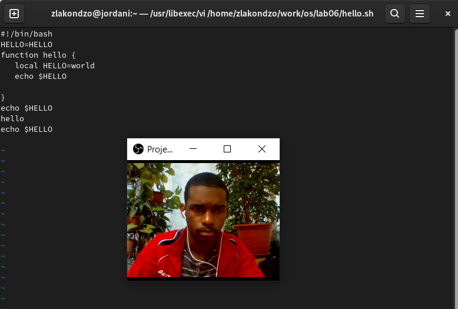{#fig:014 width=70% }

10. Ввёл символ : для перехода в режим последней строки. Записал произведённые изменения и выйдите из vi.

# Выводы

Во время лабораторной работы, познакомились с операционной системой Linux. Получили практические навыки работы с редактором vi, установленным по умолчанию практически во всех дистрибутивах.

# Контрольные вопросы

1. **Дайте краткую характеристику режимам работы редактора vi.**

  Vim - это интерактивный экранный редактор, который используется для создания и редактирования текстовых файлов. Все действия vi производит в буфере. Произведенные изменения могут быть записаны на диск или отменены. Редактор vi имеет три режима: командный, вставки/ввода и последняя строка.
  
2. **Как выйти из редактора, не сохраняя произведённые изменения?**

  Можно так сделать с помошью клавицу q или q!
  
3. **Назовите и дайте краткую характеристику командам позиционирования.**

- 0 (ноль) — переход в начало строки;
- $ — переход в конец строки;
- G — переход в конец файла;
- n G — переход на строку с номером n.

4. **Что для редактора vi является словом?**

  Редактор vi предполагает, что слово - это строка символов, которая может включать в себя буквы, цифры и символы подчеркивания.

5. **Каким образом из любого места редактируемого файла перейти в начало (конец) файла?**

  G — переход в конец файла и “1G” - переход в начало файла.

6. **Назовите и дайте краткую характеристику основным группам команд редактирования.**
  
  Вставка текста: 
  a — вставить текст после курсора;
  A — вставить текст в конец строки;
  i — вставить текст перед курсором;
 (n)i — вставить текст n раз;
  I — вставить текст в начало строки.
  
  Вставка строки: 
  o — вставить строку под курсором;
  O — вставить строку над курсором.
  
  Удаление текста:
  – x — удалить один символ в буфер;
  – d w — удалить одно слово в буфер;
  – d $ — удалить в буфер текст от курсора до конца строки;
  – d 0 — удалить в буфер текст от начала строки до позиции курсора;
  – d d — удалить в буфер одну строку;
  – n d d — удалить в буфер 𝑛 строк.
  
  Отмена и повтор произведённых изменений:
  - u — отменить последнее изменение;
  - . — повторить последнее изменение.
  
  Копирование текста в буфер:
  -y - скопировать строку в буфер;
  – n Y — скопировать 𝑛 строк в буфер;
  – y w — скопировать слово в буфер.
  
  Вставка текста из буфера:
  - p — вставить текст из буфера после курсора;
  - P — вставить текст из буфера перед курсором.
  
  Замена текста: 
  - c w - аменить слово;
  – n c w — заменить 𝑛 слов;
  – c $ — заменить текст от курсора до конца строки;
  – r — заменить слово;
  – R — заменить текст.
  
  Поиск текста:
 - / -текст — произвести поиск вперёд по тексту указанной строки символов текст;
 - ? - текст — произвести поиск назад по тексту указанной строки символов текст.
 
7. **Необходимо заполнить строку символами $. Каковы ваши действия?**

8. **Как отменить некорректное действие, связанное с процессом редактирования?**

   u — отменить последнее изменение
   
9. **Назовите и дайте характеристику основным группам команд режима последней строки.**
  
  Режим последней строки — используется для записи изменений в файл и выхода из редактора.

10. **Как определить, не перемещая курсора, позицию, в которой заканчивается строка?**
   
   $ — переход в конец строки
   
11. **Выполните анализ опций редактора vi (сколько их, как узнать их назначение и т.д.).**

  Опции редактора vi позволяют настроить рабочую среду. Для задания опций используется команда set (в режиме последней строки): – : set all — вывести полный список опций; – : set nu — вывести номера строк; – : set list — вывести невидимые символы; – : set ic — не учитывать при поиске, является ли символ прописным или строчным.

12. **Как определить режим работы редактора vi?**

В редакторе vi есть два основных режима: командный режим и режим вставки. По умолчанию работа начинается в командном режиме. В режиме вставки лавиатура используется для набора текста. Для выхода в командный режим используется клавиша Esc или комбинация Ctrl + c .

13. **Постройте граф взаимосвязи режимов работы редактора vi.**

::: {#refs}
:::
