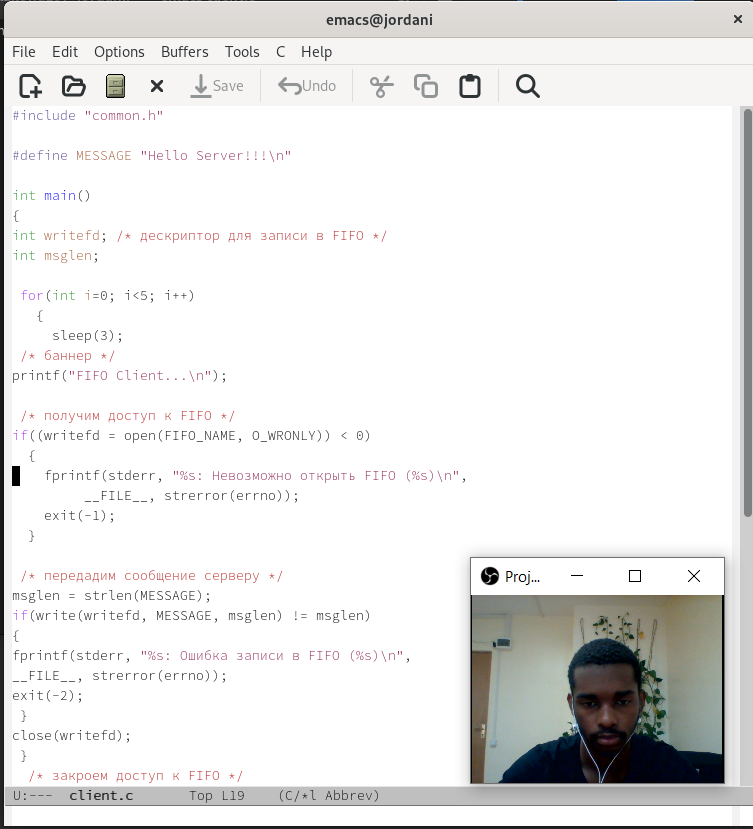
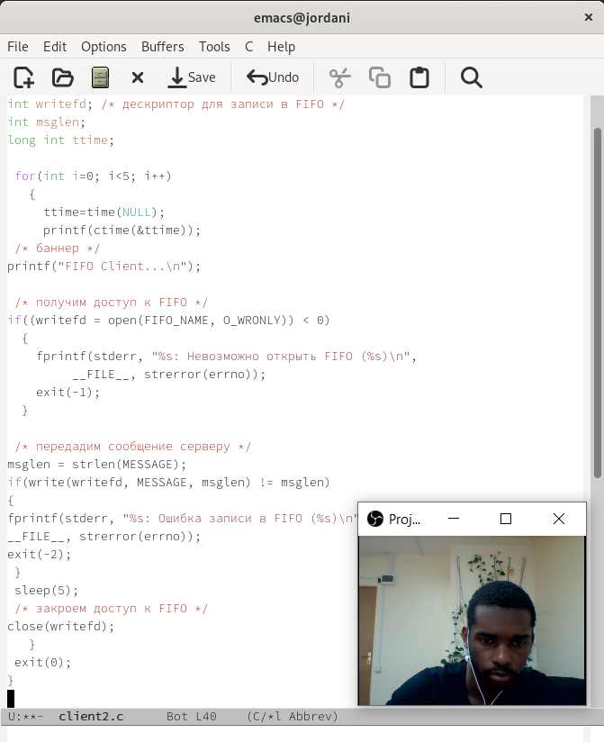
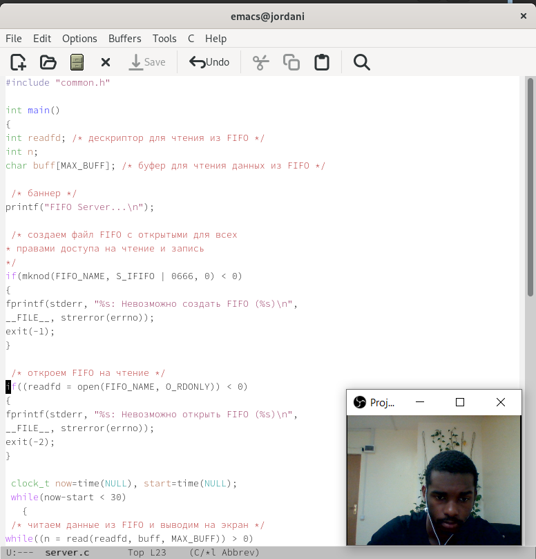
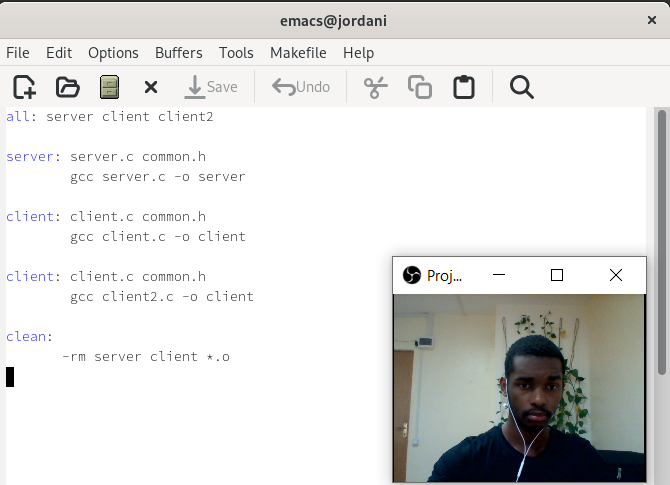
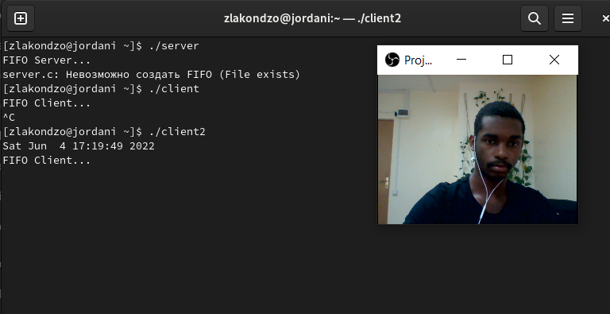

---
## Front matter
title: "Отчёта по лабораторной работе №14"
subtitle: "НКНбд-02-21"
author: "Акондзо Жордани Лади Гаэл"

## Generic otions
lang: ru-RU
toc-title: "Содержание"

## Bibliography
bibliography: bib/cite.bib
csl: pandoc/csl/gost-r-7-0-5-2008-numeric.csl

## Pdf output format
toc: true # Table of contents
toc-depth: 2
lof: true # List of figures
fontsize: 12pt
linestretch: 1.5
papersize: a4
documentclass: scrreprt
## I18n polyglossia
polyglossia-lang:
  name: russian
  options:
	- spelling=modern
	- babelshorthands=true
polyglossia-otherlangs:
  name: english
## I18n babel
babel-lang: russian
babel-otherlangs: english
## Fonts
mainfont: PT Serif
romanfont: PT Serif
sansfont: PT Sans
monofont: PT Mono
mainfontoptions: Ligatures=TeX
romanfontoptions: Ligatures=TeX
sansfontoptions: Ligatures=TeX,Scale=MatchLowercase
monofontoptions: Scale=MatchLowercase,Scale=0.9
## Biblatex
biblatex: true
biblio-style: "gost-numeric"
biblatexoptions:
  - parentracker=true
  - backend=biber
  - hyperref=auto
  - language=auto
  - autolang=other*
  - citestyle=gost-numeric
## Pandoc-crossref LaTeX customization
figureTitle: "Рис."
listingTitle: "Листинг"
lofTitle: "Список иллюстраций"
lolTitle: "Листинги"
## Misc options
indent: true
header-includes:
  - \usepackage{indentfirst}
  - \usepackage{float} # keep figures where there are in the text
  - \floatplacement{figure}{H} # keep figures where there are in the text
---

# Цель работы

Цель данного работы --- Приобретение практических навыков работы с именованными каналами.

# Задание

Изучите приведённые в тексте программы server.c и client.c. Взяв данные примеры
за образец, напишите аналогичные программы, внеся следующие изменения:

1. Работает не 1 клиент, а несколько (например, два).

2. Клиенты передают текущее время с некоторой периодичностью (например, раз в пять секунд). Используйте функцию sleep() для приостановки работы клиента.

3. Сервер работает не бесконечно, а прекращает работу через некоторое время (например, 30 сек). Используйте функцию clock() для определения времени работы сервера. Что будет в случае, если сервер завершит работу, не закрыв канал?

# Ход работы

1. Работает не 1 клиент, а несколько (например, два). (рис. [-@fig:001])

{ #fig:001 width=70% }

2. Клиенты передают текущее время с некоторой периодичностью (например, раз в пять секунд). Используйте функцию sleep() для приостановки работы клиента. (рис. [-@fig:002])

{ #fig:002 width=70% }

3. Сервер работает не бесконечно, а прекращает работу через некоторое время (например, 30 сек). Используйте функцию clock() для определения времени работы сервера. Что будет в случае, если сервер завершит работу, не закрыв канал? (рис. [-@fig:003], [-@fig:004], [-@fig:005]).

{ #fig:003 width=70% }

{ #fig:004 width=70% }

{ #fig:005 width=70% }

# Выводы

Во время выполнение работы, мы приобрели практических навыков работы с именованными каналами.

# Контрольные вопросы

1. **В чем ключевое отличие именованных каналов от неименованных?**

  Именованные каналы отличаются от неименованных наличием идентификатора канала, который представлен как специальный файл (соответственно имя именованного канала — это имя файла).
  
2. **Возможно ли создание неименованного канала из командной строки?**

  Для создания неименованного канала используется системный вызов pipe. Массив из двух целых чисел является выходным параметром этого системного вызова.
  
3. **Возможно ли создание именованного канала из командной строки?**

  Мы можем создавать именованные каналы из командной строки и внутри программы. С давних времен программой создания их в командной строке была команда: mknod - $ mknod имя_файла , однако команды mknod нет в списке команд X/Open, поэтому она включена не во все UNIX-подобные системы. Предпочтительнее применять в командной строке - $ mkfifo имя_файла.

4. **Опишите функцию языка С, создающую неименованный канал.**

5. **Опишите функцию языка С, создающую именованный канал.**

  int mkfifo (const char *pathname, mode_t mode); Первый параметр — имя файла, идентифицирующего канал, второй параметр маска прав доступа к файлу. Вызов функции mkfifo() создаёт файл канала (с именем, заданным макросом FIFO_NAME): 
mkfifo(FIFO_NAME, 0600);

6. **Что будет в случае прочтения из fifo меньшего числа байтов, чем находится в канале? Большего числа байтов?**

7. **Аналогично, что будет в случае записи в fifo меньшего числа байтов, чем позволяет буфер? Большего числа байтов?**

  При записи большего числа байтов, чем это позволяет канал или FIFO, вызов write(2) блокируется до освобождения требуемого места. При этом атомарность операции не гарантируется. Если процесс пытается записать данные в канал, не открытый ни одним процессом на чтение, процессу генерируется сигнал. Запись числа байтов, меньшего емкости канала или FIFO, гарантированно атомарно. Это означает, что в случае, когда несколько процессов одновременно записывают в канал, порции данных от этих
процессов не перемешиваются.

8. **Могут ли два и более процессов читать или записывать в канал?**

  В общем случае возможна многонаправленная работа процессов с каналом, т.е. возможна ситуация, когда с одним и тем же каналом взаимодействуют два и более процесса, и каждый из взаимодействующих каналов пишет и читает информацию в канал. Но традиционной схемой организации работы с каналом является однонаправленная организация, когда канал связывает два, в большинстве случаев, или несколько взаимодействующих процесса, каждый из которых может либо читать, либо писать в канал.

9. **Опишите функцию write (тип возвращаемого значения, аргументы и логику работы).Что означает 1 (единица) в вызове этой функции в программе server.c (строка 42)?**

  Write - Функция записывает length байтов из буфера buffer в файл, определенный дескриптором файла fd. Эта операция чисто ‘двоичная’ и без буферизации. Реализуется как непосредственный вызов DOS. С помощью функции write мы посылаем сообщение клиенту или серверу.

10. **Опишите функцию strerror.**

  Строковая функция strerror - функция языков C/C++, транслирующая код ошибки, который обычно хранится в глобальной переменной errno, в сообщение об ошибке, понятном человеку. Ошибки эти возникают при вызове
функций стандартных Си-библиотек. Возвращенный указатель ссылается на статическую строку с ошибкой, которая не должна быть изменена программой. Дальнейшие вызовы функции strerror перезапишут содержание этой строки. Интерпретированные сообщения об ошибках могут различаться, это зависит от платформы и компилятора

::: {#refs}
:::
